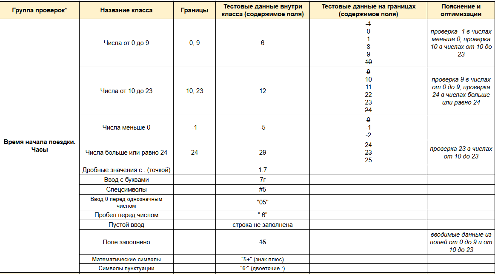

# 🗺️ Тестирование веб-приложения Яндекс Маршруты
Яндекс Маршруты — сервис, который строит маршруты для транспорта разных видов, рассчитывает время и стоимость поездки. 
В рамках учебного проекта нужно было:
* Провести тест-анализ требований на валидацию полей.
* Создать набор тест-кейсов на проверку валидации полей формы Яндекс Маршрутов. Примени техники тест-дизайна: классы эквивалентности и граничные значения.
* Протестировать валидацию полей и завести баг-репорты, если есть баги.
* Полное требование указано в документе <a href="https://docs.google.com/document/d/1tIs3KqK79vGR60EoGiDKLavvgsj0cjjrdSRK3AFdY6g/edit?tab=t.0#heading=h.7j2fbty8r7vb">Требования к Яндекс Маршрутам</a>

# Выполнение

* Выделил <a href="https://docs.google.com/spreadsheets/d/1ySqsPJujW1qsH2DF-ljQmdbrD6IiKJTw4ZnATusdM7o/edit?usp=sharing">КЭ и ГЗ</a> для полей ввода
 
 
[![Скрин][1]][1]ь 
[1]:  

  
  
  
* Написал <a href="https://docs.google.com/spreadsheets/d/11WEeWVPM__-DD__Zyl5ZMyqIIICuHSh4OSFtYusKXDQ/edit?usp=sharing">тест-кейсы</a> на валидацию полей времени и адреса
  
* Оформил баг-репорты в виде  <a href="https://docs.google.com/spreadsheets/d/1mDDwetevSOwpnhh1vjIK9hV6Ah3oN0Iy_A0JVGJtn-k/edit?usp=sharing">таблицы</a>
